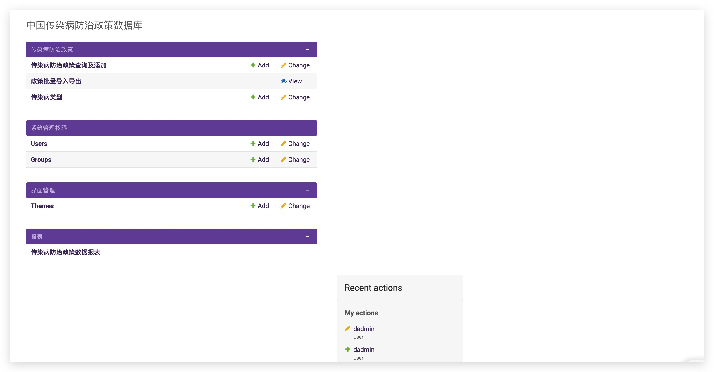
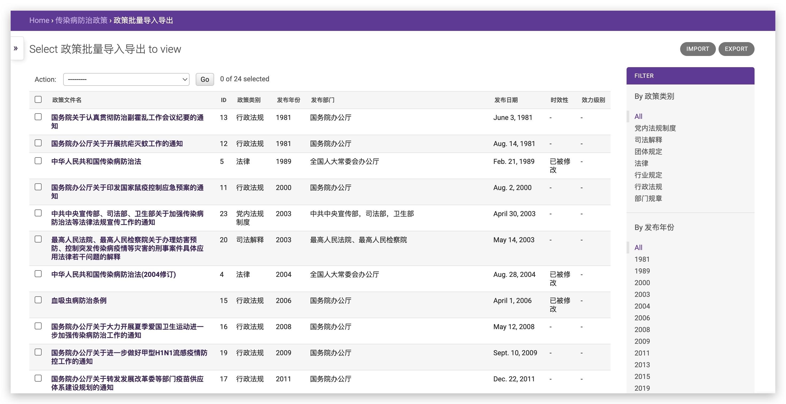
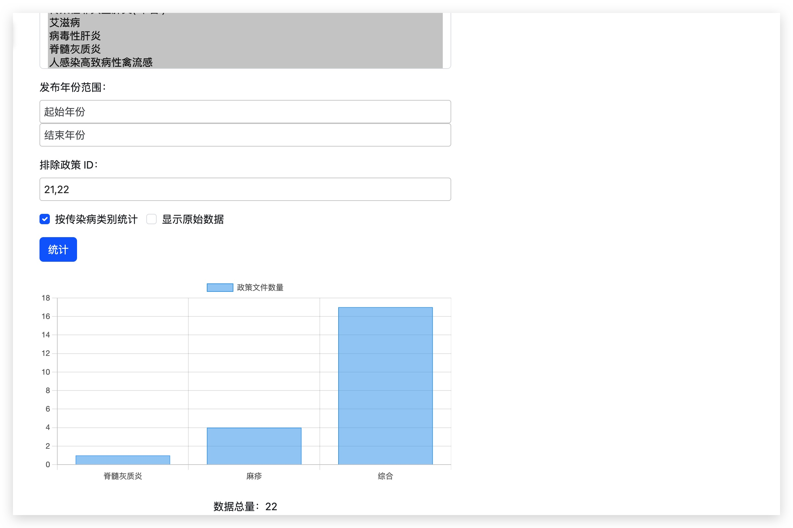
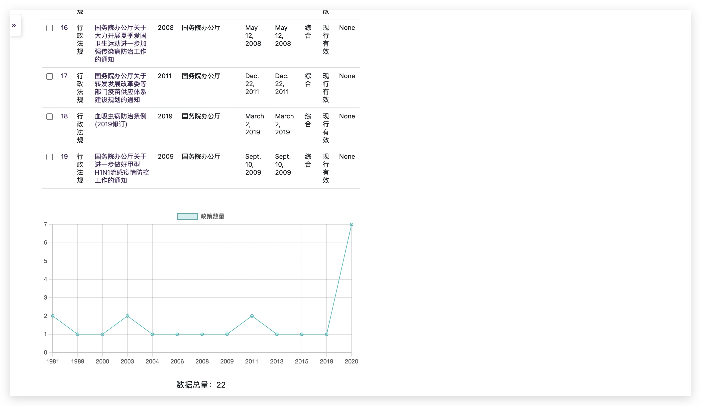

# 项目依赖
Python 3.10+
Django 4.1+

本机搭建好 Python， 安装过 pip, 以及 Django 后。 安装其他依赖：
```Bash
pip install -r requirements.txt
```

# 功能特性

* 批量导入、导出传染病防治政策数据 (import/export)
* 上传政策文件
* 可以按照传染病分类（分类可以多选），发文部门，文件标题，发布年份查询 (admin search)
* 界面主题可以维护 (admin interface)
* 可以按照年份统计政策数量，可以按照传染病分类统计政策数量，并在图表中展示 (chart.js)
* 图表展示中可以同时展示原始数据，可以选择排除结果中的部分数据，进行重新统计 

# 一、本机环境服务启动:

```Bash

 # 初始化数据，创建管理员
 python manage.py makemigrations
 python manage.py migrate
 python manage.py init_disease_types
 python manage.py createsuperuser

 #  启动服务
 python manage.py runserver 127.0.0.1:9000

 # optional: expose to external user beside localhost
 # python manage.py runserver 0.0.0.0:9000
 # 
 # 
```

可以通过 http://localhost:9000 来访问服务。
如果要开放到其他机器访问，启动时可命令设定监听 0.0.0.0:9000， 命令如上。

数据库保存在  db.sqlite3 文件的文件数据库中。 上传的文件保存在 media 目录下.

# 二、云上服务环境启动：

```Bash
python manage.py collectstatic
# 将 static 文件拷贝到 nginx 服务中
uvicorn disease_control_policy_management.asgi:application --port 8000 --workers 2
```

# 三、产品效果截图

## 产品首页


## 数据导入/导出



## 按照传染病类别统计政策数量


## 按照政策发布年份统计政策数量
